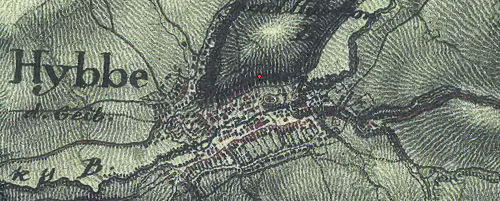
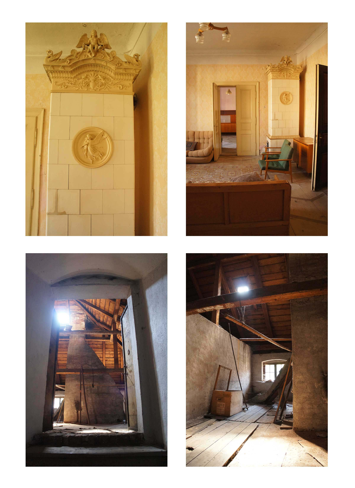
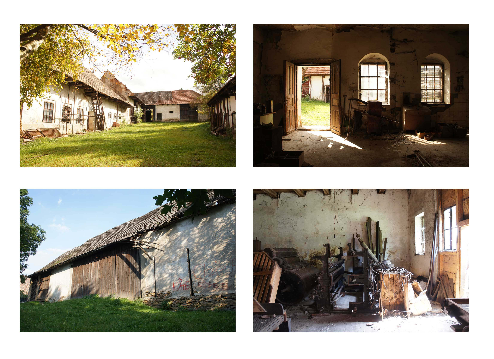
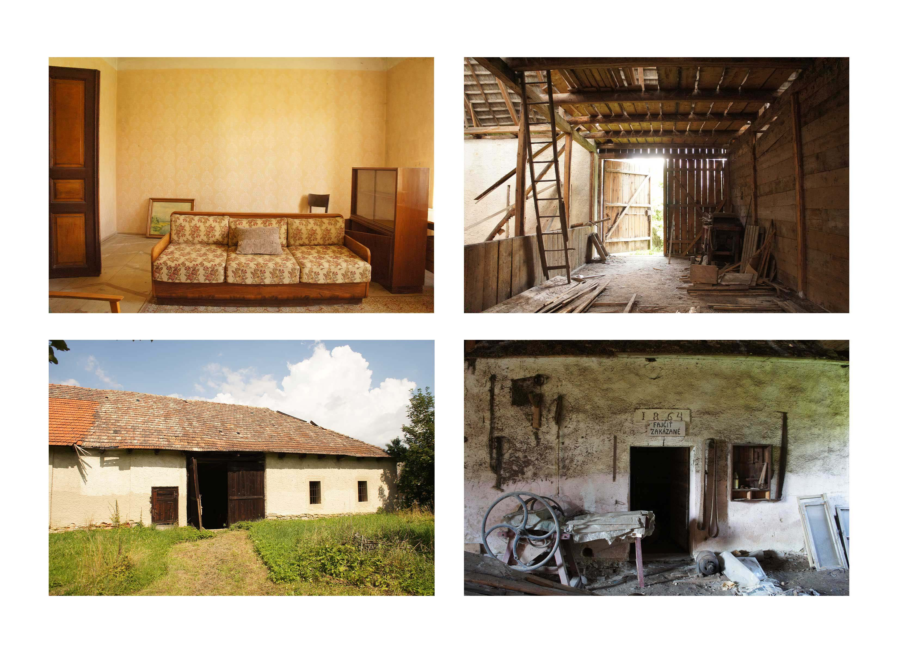
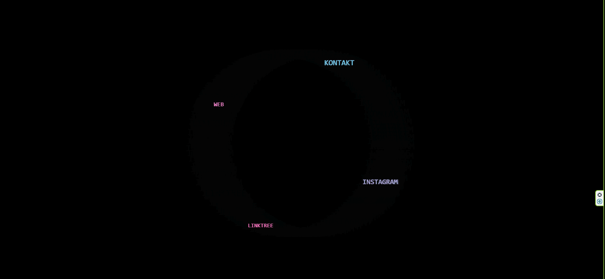

# „Hybe Barn“ digitálna vizitka – KP IV finálny projekt

Rozmýšľal som, čo vytvoriť ako finálny projekt pre KP IV. Najprv som uvažoval o vytvorení digitálnej vizitky pre moje vlastné portfólio. Nakoniec som sa rozhodol spraviť digitálnu vizitku pre webstránku rodinného projektu Hybe Barn, slovenský názov Chrobákovie dvor.  Jedná sa o dvor nachádzajúci sa v obci Hybe na Liptove.  Hlavnými Na pozemku sa nachádza veľký historický dom a hospodárske budovy. Nájdeme na ňom poľnohospodárske aj industriálne priestory, čo robia z tohto dvora raritu. 
Hybe Barn je rodinný projekt, skladajúci sa z historického domu a hospodárskych stavieb. Je v procese rekonštrukcie. Web stránka hybebarn.eu bola spustená v roku 2024, keď som bol promovať Hybe Barn na festivale mladého umenia Tehláreň. Webstránka bola narýchlo spravená, pre mňa osobne jej chýbali nejaké interaktívne prvky resp. obzvláštnenie, čo by motivovalo návštevníkov webstránky na nej ostať trochu dlhšie, trochu sa zabaviť. Odovzdávku finálneho zadania som teda vycítil ako príležitosť vymyslieť nejaké interaktívne intro pre tento web, ktorý by som mohol použiť neskôr.
Inšpirácia
Inšpiroval som sa samotným dvorom, jeho starobou, zašlou slávou aj nádejnou budúcnosťou. Farby pozadia smerovali od béžovej po zelenú – ako zašlé steny v interiéry, ktorým príjemné teplo dodávajú lúče zapadajúceho Slnka a zeleň dopĺňa príroda, ktorej kúsok možno hľadať  v sade v strede dvora.

Mapa Hýb, 19. Storočie
   
  
  
Fotografie dvora (rok 2020).

## Proces – inšpirácie na webe

Najprv som hľadal inšpiráciu v 

https://openinghours.studio/

https://nslt-library.webflow.io/#5KXqQuMoAzPQS6PiLHKg
 
Pôvodne som zamýšľal niečo takéto. Ale nakoniec som zvolil interaktívne menu, ktoré som si pamätal zo starších Flash stránok, ktoré sa vždycky dlhšie načítavali.

### Prince: Lotusflow3r (2009)

Asi inšpirácia tkvela napr. z interaktívnej webstránky Princea, z roku 2009, na ktorej promoval svoju novú hudbu a seba.
Prince bol dovtedy známy ako pionier-hudobník v internetovej ére, keďže už v roku 2001 naplno predával hudbu exkluzívne online cez svoj NPG Music Club.

https://princeonlinemuseum.com/timeline/lotusflow3r/
https://princeonlinemuseum.com/lotusflow3r/th3b0mb.html

## Proces
1.	najprv som chcel vytvoriť interaktívne menu, kde rotujú funkcie, ako kontakt, web, linktree atď.
2.	Inšpiráciou boli flash stránky z 2000-cok, nostalgia, chcel som vytvoriť menu, kde by položky ako kontakty, CV rotovali. 
3.	Menu však rotovalo dosť rýchlo, takže som ho chcel ho zmierniť, zároveň tomu ešte niečo chýbalo, tak som pridal intro.
4.	Intro - myslel som, že by bolo formou generatívnej typografie, teda názov "HYBE BARN" sa zobrazí ako zhluk bodov.
5.	Pozadie - pôvodne to bola len modrá farba (použitá na hybebarn.eu), ďalej som to chcel zmeniť, aby to bolo zaujímavejšie, rozmýšľal som nad fotkami, ale nakoniec som zvolil zmenu farby pohybom kurzora.
7.	Zvuk - v duchu starých flash webstránok, ktoré sa snažili o unikátnosť a maximalizovanie zážitku, som pridal k webstránke aj zvukovú stopu a teda som z audiobanky zobral zvuky prírody (táto konkrétna stopa bola nahrávaná v Poľsku).
8.	Particle system - celú digitálnu vizitku sprevádzajú častice, ktoré najprv vytvoria nápis a potom voľne poletujú po obrazovke. V rotujúcom menu sa funkcie po probilížení s časticami snažia vytvoriť spojenie, vytvára to sieť - networking, vlastne jadrovú myšlienku co-living.

## Použité prvky
1.	generatívna typografia - Text „HYBE BARN“ sa skladá z bodov, ktoré sa animujú do pozície a neskôr explodujú pri pohybe myšou.
2.	particle system - Po úvode sa rozbehnú častice (particles), ktoré sa pohybujú pomocou Perlin noise, majú svetelný efekt a reagujú na myš.
3.	autonómne správanie - Prvky menu rotujú okolo stredu, spomaľujú a priťahujú sa „magneticky“ ku kurzoru.
4.	mapovanie myši na HSB - Dynamické pozadie sa farebne mení podľa pohybu myši (HUE a jas).
5.	dynamika pozadia podľa času - Farba pozadia sa mení podľa dennej doby (ráno, deň, večer).
6.	zvuk - Ambientný zvuk sa (ne)spustí automaticky, je možné ho ovládať tlačidlom a sliderom.
7.	interaktivita - Všetko reaguje na pohyb myši – intro, menu, častice aj pozadie.
8.	prepájanie na ďalšie URL linky - Každý text v menu je klikateľný a vedie na reálnu URL.
